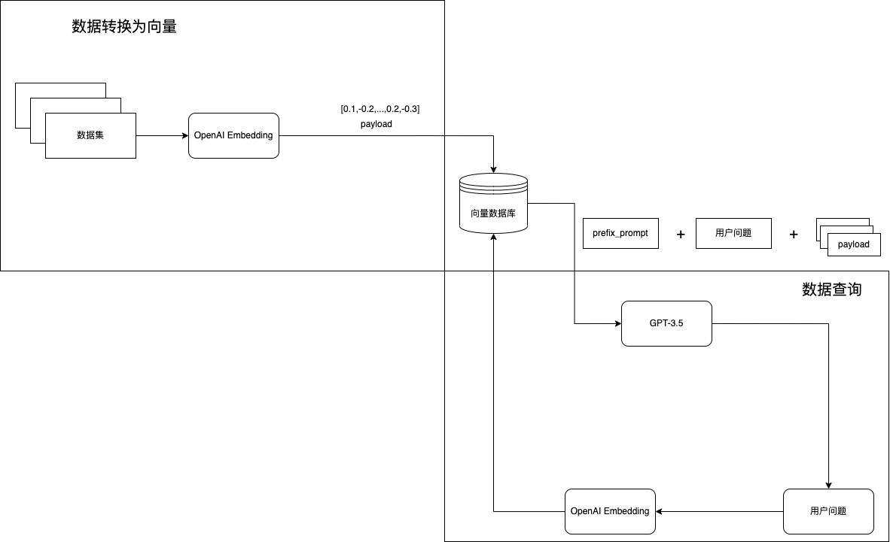

# jetsom.ai
基于向量数据库与GPT3.5的自然语言转换指令集的方案示例

## 流程

整个流程非常简单，也没有复杂的地方，相信关注GPT领域的都会看到过如上的流程。

具体步骤：
- 将基础指令数据集，转为向量存储到向量数据
- 当用户输入查询的问题时，把问题转为向量，然后从向量数据库中查询相近的答案topK
- 将topK进行去重合并，生成指令集

## 使用范围
请参考 OpenAI 的使用政策
https://openai.com/policies/usage-policies

## 关于Qdrant向量数据库
你可以查看Qdrant的官方文档：https://qdrant.tech/documentation/
使用docker启动Qdrant

`docker run -p 6333:6333 \
-v $(pwd)/qdrant_storage:/qdrant/storage \
qdrant/qdrant
`

## 具体操作流程
### 设置OPENAI_API_KEY
`export OPENAI_API_KEY=sk-xxxxxx`

### 安装依赖
`pip install -r requirements.txt`
**如果安装不成功，可以使用豆瓣镜像加速**
`python -m pip install -r requirements.txt -i http://pypi.douban.com/simple/ --trusted-host pypi.douban.com`

### 数据集入库[importData.py] 
`python src/import_data.py`

### 启动查询服务[server.py] 
`python src/server.py`
**后台持久化运行**
`nohup python src/server.py > output.log 2>&1 &`

##
我的网站地址：https://www.mashaojie.cn

## Buy me a coffee

